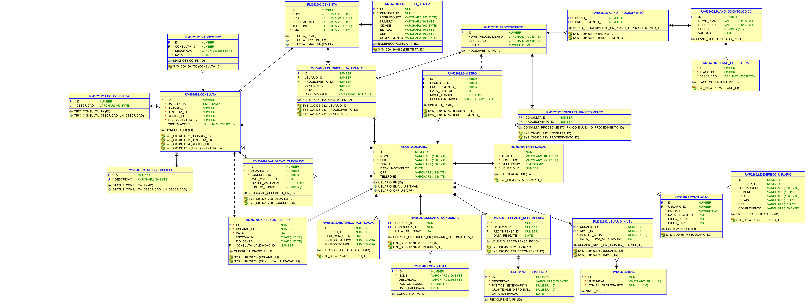

## 🚀 **OdontovisionMVC - Aplicação Java MVC na Azure**
### 📌 **Descrição**
Este projeto é uma aplicação **Java MVC** desenvolvida com **Spring Boot**, conectada ao banco de dados **Oracle** na **Azure**. O objetivo é realizar cadastro de dentistas e pacientes (usuarios), para isso foi criado uma view em Thymeleaft para que o administrador do sistema possa fazer a gestão.

#### Link do Repositório: https://github.com/challenge-fiap-github/Java-Advanced-MVC
#### Link do Vídeo: https://youtu.be/mnLcVI8NGOc 

#### Infelizmente o YouTube excluiu o vídeo de DevOps depois da entrega do Portal do Aluno, mostrei todas as evidências para o professor, coloquei o vídeo no drive, portanto caso queira assistir esse é o link certo:

https://drive.google.com/drive/folders/12CTa83-surFr0Aiwn206EILItv5Rnw5s


## 👥 Equipe

| Matrícula  | Nome                              |
|------------|-----------------------------------|
| **553568** | Sabrina da Motta Café            |
| **552692** | Luís Henrique Oliveira Da Silva  |
| **554199** | Matheus Duarte Oliveira          |

---
### 🔹 Diagrama UML - Banco de Dados Oracle

---
### Acesso VM
usuario: adminwin

senha: Fiap@2tds2025

## 📂 **Estrutura do Projeto**
```
📦 odontovisionMVC
 ┣ 📂 .idea
 ┣ 📂 .mvn
 ┣ 📂 src
 ┃ ┣ 📂 main
 ┃ ┃ ┣ 📂 java/com/java/odontovisionMVC
 ┃ ┃ ┃ ┣ 📂 controller
 ┃ ┃ ┃ ┣ 📂 model
 ┃ ┃ ┃ ┣ 📂 repository
 ┃ ┃ ┃ ┣ 📂 service
 ┃ ┃ ┃ ┣ 📜 OdontovisionMvcApplication.java
 ┃ ┃ ┣ 📂 resources
 ┃ ┃ ┃ ┣ 📂 static
 ┃ ┃ ┃ ┣ 📂 templates
 ┃ ┃ ┃ ┣ 📜 application.properties
 ┃ ┣ 📂 test
 ┣ 📂 target
 ┣ 📜 .gitattributes
 ┣ 📜 .gitignore
 ┣ 📜 DevOpsREADME.md
 ┣ 📜 HELP.md
 ┣ 📜 mvnw
 ┣ 📜 mvnw.cmd
 ┣ 📜 pom.xml
 ┣ 📜 README.md
 ┣ 📜 img.png
 ┣ 📜 img_1.png
 ┣ 📜 img_2.png
 ┣ 📂 External Libraries
 ┣ 📂 Scratches and Consoles
```

---

## ⚙️ **Pré-requisitos**
Antes de iniciar, certifique-se de ter instalado:
- **Java 17** ou superior
- **Maven 3+**
- **Conta na Azure for Students**
- **Azure CLI** instalada (`az --version`)

---

## 🏗 **Passo a Passo: Deploy na Azure**
### 🔹 **1. Configurar a Autenticação**
1. Faça login na Azure:
   ```bash
   az login
   ```
2. Confirme a assinatura ativa:
   ```bash
   az account show
   ```
3. Se necessário, selecione a assinatura correta:
   ```bash
   az account set --subscription "Azure for Students"
   ```

---

### 🔹 **2. Criar e Configurar o Web App**
1. Configuração usada para o App Service no Azure:
   ```bash
   mvn azure-webapp:config
   ```
    - **Linux** como sistema operacional
    - **B1** como plano de hospedagem
    - **Java SE 17**

---

### 🔹 **3. Realizar o Deploy**
Comandos abaixo usados para fazer o deploy:

```bash
mvn clean package
mvn azure-webapp:deploy
```

🔹 **URL pública** do Web App:  
➡️ https://odontovisionmvc-java-rm553568.azurewebsites.net
---

## 📚 **Referências**
- 📖 [Azure App Service - Deploy com Maven](https://learn.microsoft.com/pt-br/azure/app-service/quickstart-java?tabs=springboot&pivots=java-javase)
- 📖 [Azure CLI Docs](https://learn.microsoft.com/pt-br/cli/azure/install-azure-cli)

---
