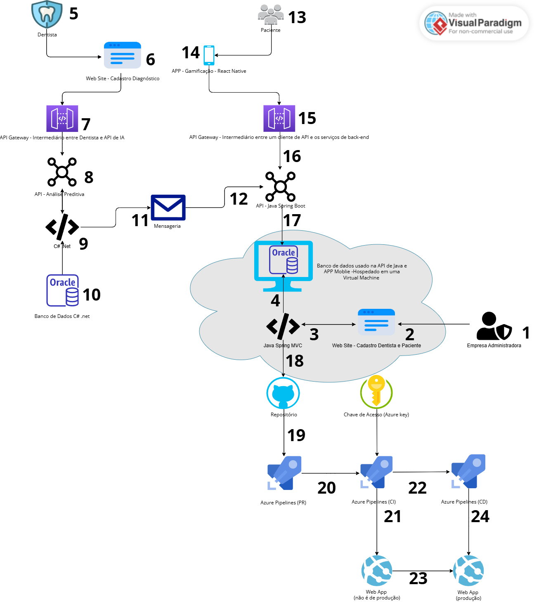

# 📘 Projeto OdontoVision – DevOps

## ✅ Sprint 3 – Funcionalidades Implementadas


## 🚀 **OdontovisionMVC - Aplicação Java MVC na Azure**
### 📌 **Descrição**
Este projeto é uma aplicação **Java MVC** desenvolvida com **Spring Boot**, conectada ao banco de dados **Oracle** na **Azure**. O objetivo é realizar cadastro de dentistas e pacientes (usuarios), para isso foi criado uma view em Thymeleaft para que o administrador do sistema possa fazer a gestão.

#### Link do Repositório: https://github.com/challenge-fiap-github/Java-Advanced-MVC
#### Link do Vídeo: https://youtu.be/mnLcVI8NGOc 

#### Infelizmente o YouTube excluiu o vídeo de DevOps depois da entrega do Portal do Aluno, mostrei todas as evidências para o professor, coloquei o vídeo no drive, portanto caso queira assistir esse é o link certo:

https://drive.google.com/drive/folders/12CTa83-surFr0Aiwn206EILItv5Rnw5s


## 👥 Equipe

| Matrícula  | Nome                              |
|------------|-----------------------------------|
| **553568** | Sabrina da Motta Café            |
| **552692** | Luís Henrique Oliveira Da Silva  |
| **554199** | Matheus Duarte Oliveira          |

---
### 🔹 Diagrama UML - Banco de Dados Oracle

---
### Acesso VM
usuario: adminwin

senha: Fiap@2tds2025

## 📂 **Estrutura do Projeto**
```
📦 odontovisionMVC
 ┣ 📂 .idea
 ┣ 📂 .mvn
 ┣ 📂 src
 ┃ ┣ 📂 main
 ┃ ┃ ┣ 📂 java/com/java/odontovisionMVC
 ┃ ┃ ┃ ┣ 📂 controller
 ┃ ┃ ┃ ┣ 📂 model
 ┃ ┃ ┃ ┣ 📂 repository
 ┃ ┃ ┃ ┣ 📂 service
 ┃ ┃ ┃ ┣ 📜 OdontovisionMvcApplication.java
 ┃ ┃ ┣ 📂 resources
 ┃ ┃ ┃ ┣ 📂 static
 ┃ ┃ ┃ ┣ 📂 templates
 ┃ ┃ ┃ ┣ 📜 application.properties
 ┃ ┣ 📂 test
 ┣ 📂 target
 ┣ 📜 .gitattributes
 ┣ 📜 .gitignore
 ┣ 📜 DevOpsREADME.md
 ┣ 📜 HELP.md
 ┣ 📜 mvnw
 ┣ 📜 mvnw.cmd
 ┣ 📜 pom.xml
 ┣ 📜 README.md
 ┣ 📜 img.png
 ┣ 📜 img_1.png
 ┣ 📜 img_2.png
 ┣ 📂 External Libraries
 ┣ 📂 Scratches and Consoles
```

---

## ⚙️ **Pré-requisitos**
Antes de iniciar, certifique-se de ter instalado:
- **Java 17** ou superior
- **Maven 3+**
- **Conta na Azure for Students**
- **Azure CLI** instalada (`az --version`)

---

## 🏗 **Passo a Passo: Deploy na Azure**
### 🔹 **1. Configurar a Autenticação**
1. Faça login na Azure:
   ```bash
   az login
   ```
2. Confirme a assinatura ativa:
   ```bash
   az account show
   ```
3. Se necessário, selecione a assinatura correta:
   ```bash
   az account set --subscription "Azure for Students"
   ```

---

### 🔹 **2. Criar e Configurar o Web App**
1. Configuração usada para o App Service no Azure:
   ```bash
   mvn azure-webapp:config
   ```
    - **Linux** como sistema operacional
    - **F1** como plano de hospedagem
    - **Java SE 17**

---

### 🔹 **3. Realizar o Deploy**
Comandos abaixo usados para fazer o deploy:

```bash
mvn clean package
mvn azure-webapp:deploy
```

🔹 **URL pública** do Web App:  
➡️ https://odontovisionmvc-java-rm553568.azurewebsites.net
---

## 🚀 Sprint 4 – Integração Contínua (CI), Banco de Dados e Testes de Persistência

🔹 **Vídeo Sprint 4:**  
➡️ https://youtu.be/ZKhnviyEjqA

🔹 **URL pública do Web App:**
➡️ https://odontovisionmvc-java-rm553568.azurewebsites.net


### Arquitetura Final


1. **Empresa Administradora:**  
   Responsável pela gestão e administração do sistema.

2. **Cadastro de Usuários:**  
   O administrador acessa o sistema com login e senha para cadastrar dentistas e pacientes.

3. **MVC (Model-View-Controller):**  
   Responsável por processar e gerenciar as informações enviadas e recebidas pelo site, repassando os dados para o banco de dados Oracle.

4. **Banco de Dados Oracle:**  
   Armazena todas as informações processadas pelo sistema.

5. **Dentista:**  
   Após realizar consultas, o dentista acessa o sistema via um site específico.

6. **Cadastro de Diagnóstico:**  
   O dentista registra as informações da consulta, incluindo procedimentos realizados e observações clínicas.

7. **API Gateway:**  
   Atua como intermediário entre o site do dentista e a API de Inteligência Artificial.

8. **API de Inteligência Artificial:**  
   Processa os diagnósticos enviados pelos dentistas e realiza análises preditivas.

9. **Aplicação C# .NET:**  
   Responsável por processar as informações geradas pela API de IA e repassá-las ao banco de dados Oracle.

10. **Banco de Dados Oracle (C# .NET):**  
    Armazena os dados gerados pela API de IA.

11. **Mensageria:**  
    Sistema de comunicação que envia informações da aplicação C# para a API Java.

12. **API Java:**  
    Processa as informações recebidas e as disponibiliza para o aplicativo mobile.

13. **Paciente:**  
    Acessa o sistema para visualizar informações e interagir com os serviços disponíveis.

14. **Aplicativo Mobile (Gamificação):**  
    Aplicativo desenvolvido em React Native, oferecendo funcionalidades interativas para o paciente.

15. **API Gateway (Mobile):**  
    Intermedia a comunicação entre o aplicativo mobile e a API Java.

16. **API Java (Backend Mobile):**  
    Recebe as informações do aplicativo mobile e as processa.

17. **Banco de Dados Oracle (Mobile):**  
    Armazena as informações processadas pela API Java para o aplicativo mobile.

18. **Código-fonte no GitHub**  
    O projeto Java Spring MVC (cadastro de dentistas e pacientes) está versionado em um repositório Git no GitHub, permitindo colaboração, histórico de alterações e integração com os pipelines automatizados.

19. **Pipeline de Pull Request (PR)**  
    Cada nova Pull Request aciona um pipeline de PR no Azure Pipelines que executa:
   - Linting (análise estática)
   - Build (compilação)
   - Testes unitários rápidos  
     O merge é bloqueado se alguma etapa falhar, garantindo qualidade antes de entrar no branch **main**.

20. **Pipeline de Integração Contínua (CI) + Criação de Release**  
    Após o merge, o pipeline de CI:
   - Repete os testes de qualidade e segurança
   - Acessa segredos via Azure Key Vault
   - Empacota o aplicativo em um artefato (ZIP com JAR/WAR + web.config)
   - Gera automaticamente uma Release (versão numerada) com esse artefato e publica nos Releases do Azure Pipelines.

21. **Release – Fase de Homologação**  
    A nova Release é implantada, via estágio de Release Pipeline, no Azure App Service de Homologação (Web App não produtivo). Validações de QA ocorrem aqui sem afetar usuários finais.

22. **Aprovação & Gatilho para Produção**  
    Quando a Release é aprovada (manual ou por checks automatizados), o estágio seguinte do Release Pipeline é liberado. Configurações de ambiente e variáveis específicas de produção são aplicadas nessa etapa.

23. **Promoção da Release para Produção**  
    A Release aprovada é promovida para o Web App de Produção.

24. **Deploy Final em Produção**  
    A versão publicada da Release entra em operação para dentistas, pacientes e administradores.  
    Todo update de código segue o mesmo ciclo — PR → CI → Release Pipeline (Homologação → Produção) — garantindo entregas contínuas, controladas e auditáveis.


### ⚙️ Integração Contínua com Azure DevOps

Para configurar o processo de **CI (Continuous Integration)** com **Java 17** e **Maven**, utilizamos o seguinte arquivo `azure-pipelines.yml`:

Esse pipeline está dividido em **3 estágios principais**:

1. `CriarInfra` – Criação da infraestrutura no Azure
2. `BuildApp` – Compilação do projeto Java com Maven
3. `DeployApp` – Publicação do JAR no Azure App Service

---

### Yaml Completo

```yaml
trigger:
   branches:
      include:
         - main
         - master

pool:
   vmImage: "ubuntu-latest"

variables:
   - name: rm
     value: rm553568
   - name: location
     value: brazilsouth
   - name: resourceGroup
     value: odontovisionMVC-Java-rm553568-rg
   - name: service-plan
     value: asp-odontovisionMVC-Java-rm553568
   - name: app-name
     value: odontovisionMVC-Java-rm553568
   - name: runtime
     value: JAVA|17-java17
   - name: sku
     value: F1
   - name: nome-artefato
     value: odontovision

stages:
   # -------------------- INFRA -----------------------
   - stage: CriarInfra
     jobs:
        - job: criaWebApp
          displayName: Criar ou atualizar o Serviço de Aplicativo
          steps:
             - task: AzureCLI@2
               inputs:
                  azureSubscription: 'Azure for Students(035f5616-432c-454b-b3f6-52a1f6a8b17b)'
                  scriptType: 'bash'
                  scriptLocation: 'inlineScript'
                  inlineScript: |
                     echo "Criando Resource Group (se necessário)..."
                     az group create --location $(location) --name $(resourceGroup)

                     echo "Criando App Service Plan (se necessário)..."
                     az appservice plan create -g $(resourceGroup) -n $(service-plan) --is-linux --sku $(sku) || true

                     echo "Criando Web App (se necessário)..."
                     az webapp create -g $(resourceGroup) -p $(service-plan) -n $(app-name) --runtime "$(runtime)" || true
               displayName: 'Criar WebApp Linux com Java 17'

   # -------------------- BUILD -----------------------
   - stage: BuildApp
     jobs:
        - job: buildWebApp
          displayName: Realizar o Build da aplicação
          steps:
             - task: Maven@4
               displayName: 'Build OdontoVision'
               inputs:
                  mavenPomFile: 'pom.xml'
                  mavenOptions: '-Xmx3072m'
                  jdkVersionOption: 1.17
                  goals: 'package'
                  publishJUnitResults: true
                  testResultsFiles: '**/surefire-reports/TEST-*.xml'

             - task: CopyFiles@2
               displayName: 'Copiar JAR gerado'
               inputs:
                  SourceFolder: '$(System.DefaultWorkingDirectory)'
                  Contents: '**/target/*.jar'
                  TargetFolder: '$(Build.ArtifactStagingDirectory)'

             - task: PublishBuildArtifacts@1
               displayName: 'Publicar artefato OdontoVision'
               inputs:
                  PathtoPublish: '$(Build.ArtifactStagingDirectory)'
                  ArtifactName: $(nome-artefato)

   # -------------------- DEPLOY -----------------------
   - stage: DeployApp
     dependsOn: BuildApp
     jobs:
        - job: DeployWebApp
          displayName: Realizar Deploy no Azure App Service
          steps:
             - task: DownloadBuildArtifacts@1
               displayName: 'Baixar artefato gerado'
               inputs:
                  buildType: 'current'
                  downloadType: 'single'
                  artifactName: '$(nome-artefato)'
                  downloadPath: '$(System.DefaultWorkingDirectory)/$(nome-artefato)'

             - task: AzureRmWebAppDeployment@4
               displayName: 'Deploy OdontoVision JAR'
               inputs:
                  azureSubscription: 'Azure for Students(035f5616-432c-454b-b3f6-52a1f6a8b17b)'
                  appType: 'webAppLinux'
                  WebAppName: $(app-name)
                  packageForLinux: '$(System.DefaultWorkingDirectory)/$(nome-artefato)/**/*.jar'
```

### 🔁 Trigger

```yaml
trigger:
  branches:
    include:
      - main
      - master
```

Esse bloco define que o pipeline será executado automaticamente quando houver push nos branches `main` ou `master`.

---

### 🧾 Variáveis

```yaml
variables:
  - name: rm
    value: rm553568
  - name: location
    value: brazilsouth
  - name: resourceGroup
    value: odontovisionMVC-Java-rm553568-rg
  - name: service-plan
    value: asp-odontovisionMVC-Java-rm553568
  - name: app-name
    value: odontovisionMVC-Java-rm553568
  - name: runtime
    value: JAVA|17-java17
  - name: sku
    value: F1
  - name: nome-artefato
    value: odontovision
```

Essas variáveis tornam o pipeline reutilizável e centralizam a configuração do Azure (nome do app, plano de serviço, localização, runtime etc).

---

### 🚀 Stage 1: `CriarInfra`

Cria os recursos necessários no Azure:

```yaml
az group create --location $(location) --name $(resourceGroup)
az appservice plan create -g $(resourceGroup) -n $(service-plan) --is-linux --sku $(sku) || true
az webapp create -g $(resourceGroup) -p $(service-plan) -n $(app-name) --runtime "$(runtime)" || true
```

* Cria o **Resource Group** caso não exista
* Cria o **App Service Plan** Linux com SKU gratuito (F1)
* Cria o **Web App** com suporte a Java 17

---

### 🔧 Stage 2: `BuildApp`

Executa o **build do projeto Java com Maven** e empacota em um `.jar`.

```yaml
- task: Maven@4
  goals: 'package'
```

Depois:

* Copia o `.jar` gerado
* Publica como artefato para a próxima etapa (`DeployApp`)

---

### 🚚 Stage 3: `DeployApp`

Realiza o deploy da aplicação no **Azure Web App**.

```yaml
- task: AzureRmWebAppDeployment@4
  appType: 'webAppLinux'
  WebAppName: $(app-name)
  packageForLinux: '**/*.jar'
```

Usa o artefato gerado na etapa de build e publica automaticamente para o App Service.

---

### 📌 Observações Finais

* 💡 O `|| true` nos comandos `az` evita que o pipeline falhe se o recurso já existir.
* ✅ O `runtime: JAVA|17-java17` garante compatibilidade com o Spring Boot.
* ☁️ O App Service precisa estar configurado com stack Java 17 + Linux.
* 🔐 A conexão com o Azure é feita pela `azureSubscription`, que deve estar configurada previamente no DevOps.

---

### 💾 Máquina Virtual Oracle – SQL Developer

A VM que hospeda o banco de dados Oracle SQL Developer está configurada com os seguintes dados:

* **Usuário:** `OdontoVision`
* **Senha:** `OdontoVision@2025`
* **Endereço IP Público:** `135.119.153.231`
* **Grupo de Recursos (Azure):** `rg-vm-odontovision-win`
* **Sistema Operacional:** `Windows`

---

### 🧪 Verificação de Persistência de Dados

Após a execução do sistema e persistência via JPA/Hibernate, os dados podem ser verificados no banco de dados com as seguintes queries SQL:

#### 📌 Consulta de usuários e seus endereços:

```sql
SELECT * FROM usuario u
LEFT JOIN endereco_usuario e
  ON u.id = e.usuario_id;
```

#### 📌 Consulta de dentistas e endereços da clínica:

```sql
SELECT * FROM dentista d
LEFT JOIN endereco_clinica ec
  ON d.id = ec.dentista_id;
```
🔹 **URL pública** do Web App:  
➡️ https://odontovisionmvc-java-rm553568.azurewebsites.net