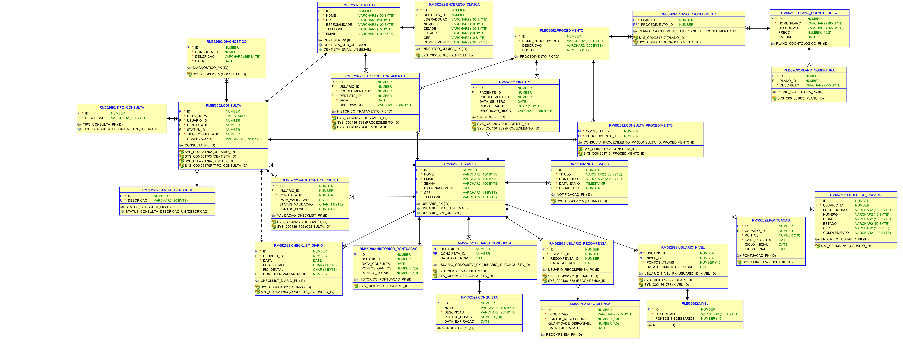

# 🦷 OdontoVision - Sistema Integrado de Gamificação e Análise Preditiva

## 📌 Sobre o Projeto
A **OdontoVision** é uma solução inovadora para clientes da **Odontoprev**, combinando **gamificação, análise preditiva por IA e integração com recompensas**. O sistema incentiva a adesão dos pacientes aos cuidados odontológicos, permitindo que acumulem pontos e participem de um programa de fidelidade.

A solução envolve:
- **📱 Aplicativo móvel (React Native):** aplicativo que será utilizado pelo paciente.
- **🍵 API Java:** desenvolvida para conectar com o aplicativo.
- **💻 Plataforma Web (C#):** utilizada pelos dentistas para registrar diagnósticos e alimentar a base de dados.
- **🧠 Inteligência Artificial (Python - Random Forest):** identifica possíveis fraudes e inconsistências nos diagnósticos.
- **☕ MVC Java:** plataforma para cadastro de dentistas e pacientes(usuarios), realizadas por um admin.
- **🔗 Integração Futura:** conexão com **Livelo** para ampliar o catálogo de recompensas.

---

## 👥 Equipe
| Matrícula  | Nome                              |
|------------|-----------------------------------|
| **553568** | Sabrina da Motta Café            |
| **552692** | Luís Henrique Oliveira Da Silva  |
| **554199** | Matheus Duarte Oliveira          |

---

## 🛠 Tecnologias Utilizadas e Versões


- **Java**: 17
- **Spring Boot** (parent): 3.4.3
- **Spring AI** (BOM): 1.0.0-M7
- **Spring Boot Admin** (BOM): 3.4.5

### Starters Spring Boot
- **spring-boot-starter-data-jpa**
- **spring-boot-starter-jdbc**
- **spring-boot-starter-thymeleaf**
- **spring-boot-starter-web**
- **spring-boot-starter-security**
- **spring-boot-starter-oauth2-client**
- **spring-boot-starter-test** (escopo `test`)

### Banco de Dados
- **Oracle JDBC Driver**: `com.oracle.database.jdbc:ojdbc11` (runtime)

### Inteligência Artificial
- **Spring AI Starter (Azure OpenAI)**: `org.springframework.ai:spring-ai-starter-model-azure-openai`
- **Azure OpenAI SDK**: `com.azure:azure-ai-openai:1.0.0-beta.16`
- **Azure Identity**: `com.azure:azure-identity:1.13.3`

### Spring Boot Admin
- **Admin Server**: `de.codecentric:spring-boot-admin-starter-server`
- **Admin Client**: `de.codecentric:spring-boot-admin-starter-client`

### Plugins Maven
- **spring-boot-maven-plugin** (versão gerenciada pelo parent)
- **azure-webapp-maven-plugin**: 2.8.0

---
### #### Link do Vídeo: https://youtu.be/zl-xSMVa724
Caso haja alguma dúvida sobre a persistência de dados no Banco, segue o vídeo feito para DevOps da aplicação funcionando na nuvem com o banco Oracle

#### Link do Vídeo: https://youtu.be/ZKhnviyEjqA

---
## 🗂 Arquitetura do Sistema
### 🔹 Diagrama Banco de Dados


### 🔹 Diagrama UML Java


## 📜 Instalação e Configuração
### ✅ Pré-requisitos
- JDK 17+
- Maven 3.8+
- Banco de Dados Oracle (`application.properties`) - já configurado

### 🔧 Passos para rodar o projeto
#### 1. Clonar o repositório
```sh
git clone https://github.com/SEU-USUARIO/odontovision.git
cd odontovision
```
#### 2. Executar os comandos Maven
```sh
mvn clean
mvn clean install
mvn spring-boot:run
```
#### Acesso:
Login: admin

Senha: admin123

---

### Exemplos para Teste

### **Dentista**
- **Nome:** Dra. Camila Souza
- **Email:** camila.souza@odontovision.com
- **Telefone:** (85) 99788-2233
- **CRO:** 456789-CE
- **Especialidade:** Periodontia
- **Endereço:** Rua das Dunas, 789, Fortaleza - CE
- **CEP:** 60115-275

---

### **Usuário**
- **Nome:** Marcos Vinícius Lima
- **Email:** marcos.lima@email.com
- **CPF:** 369.258.147-99
- **Data de Nascimento:** 1995-11-03
- **Telefone:** (48) 99944-1122
- **Endereço:** Avenida Beira-Mar, 150, Florianópolis - SC
- **CEP:** 88015-200

