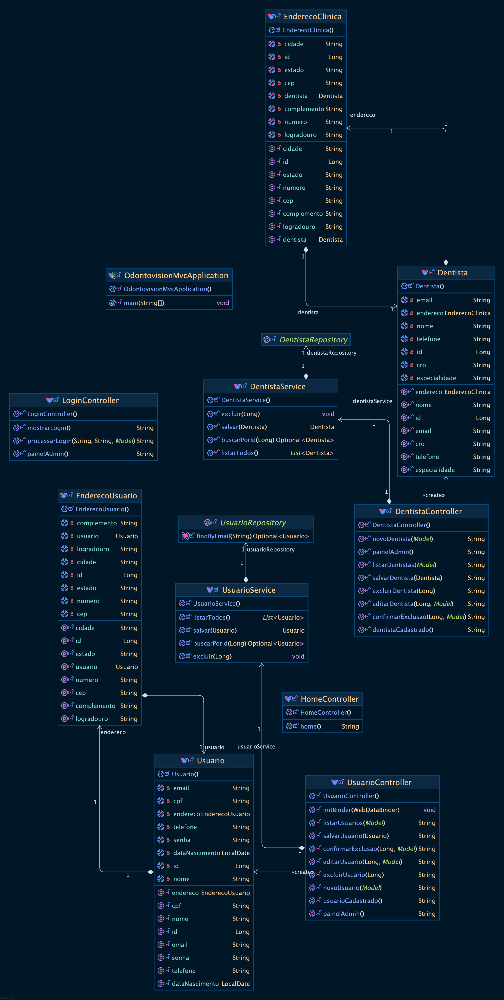

# 🦷 OdontoVision - Sistema Integrado de Gamificação e Análise Preditiva

## 📌 Sobre o Projeto
A **OdontoVision** é uma solução inovadora para clientes da **Odontoprev**, combinando **gamificação, análise preditiva por IA e integração com recompensas**. O sistema incentiva a adesão dos pacientes aos cuidados odontológicos, permitindo que acumulem pontos e participem de um programa de fidelidade.

A solução envolve:
- **📱 Aplicativo móvel (React Native):** define o planejamento de consultas e checklist diário de higiene bucal.
- **💻 Plataforma Web (C#):** utilizada pelos dentistas para registrar diagnósticos e alimentar a base de dados.
- **🧠 Inteligência Artificial (Python - Random Forest):** identifica possíveis fraudes e inconsistências nos diagnósticos.
- **🎮 Sistema de Gamificação:** recompensa os pacientes com pontos, dobrando-os se mantiverem uma boa higiene bucal.
- **🔗 Integração Futura:** conexão com **Livelo** para ampliar o catálogo de recompensas.

---

## 👥 Equipe
| Matrícula  | Nome                              |
|------------|-----------------------------------|
| **553568** | Sabrina da Motta Café            |
| **552692** | Luís Henrique Oliveira Da Silva  |
| **554199** | Matheus Duarte Oliveira          |

---

## 🛠 Tecnologias Utilizadas

### 🔹 **Back-end:**
- Java 17
- Spring Boot 3.4.3 (MVC, JPA, Thymeleaf)

### 🔹 **Banco de Dados:**
- Oracle Database

### 🔹 **Front-end Web:**
- HTML + CSS + Thymeleaf (para administração cadastrar dentistas e pacientes)

### 🔹 **Aplicativo Móvel:**
- React Native + TypeScript

### 🔹 **Análise de Dados e IA:**
- Python (Random Forest)

### 🔹 **Plataforma Web Dentistas:**
- C# .NET Core

---

## 🗂 Arquitetura do Sistema
### 🔹 Diagrama UML


### 🔹 Diagrama UML Java


### Link para o Vídeo: https://youtu.be/RctTLVTSYdo


## 📜 Instalação e Configuração
### ✅ Pré-requisitos
- JDK 17+
- Maven 3.8+
- Banco de Dados Oracle (`application.properties`) - já configurado

### 🔧 Passos para rodar o projeto
#### 1. Clonar o repositório
```sh
git clone https://github.com/SEU-USUARIO/odontovision.git
cd odontovision
```
#### 2. Executar os comandos Maven
```sh
mvn clean
mvn clean install
mvn spring-boot:run
```
#### Acesso:
Login: admin123

Senha: admin123

---

### 📌 Desenvolvimento

#### O projeto é dividido em módulos independentes que se comunicam por meio de APIs REST:

•	Spring Boot (Backend Principal): Gerencia usuários, pontuação, consultas e regras de gamificação.

•	React Native (Mobile App): Interface para pacientes acompanharem sua pontuação e agendarem consultas.

•	C# .NET (Plataforma Web Dentistas): Interface para dentistas registrarem diagnósticos.

•	Python (IA): Analisa padrões suspeitos para identificar fraudes

---
### Exemplos para Teste

### **Dentista**
- **Nome:** Dra. Camila Souza
- **Email:** camila.souza@odontovision.com
- **Telefone:** (85) 99788-2233
- **CRO:** 456789-CE
- **Especialidade:** Periodontia
- **Endereço:** Rua das Dunas, 789, Fortaleza - CE
- **CEP:** 60115-275

---

### **Usuário**
- **Nome:** Marcos Vinícius Lima
- **Email:** marcos.lima@email.com
- **CPF:** 369.258.147-99
- **Data de Nascimento:** 1995-11-03
- **Telefone:** (48) 99944-1122
- **Endereço:** Avenida Beira-Mar, 150, Florianópolis - SC
- **CEP:** 88015-200

